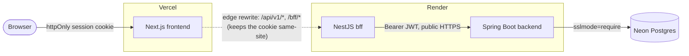

# fernbank

[](https://github.com/dsouzamelroy2007/fernbank/actions/workflows/backend-ci.yml)
[](https://github.com/dsouzamelroy2007/fernbank/actions/workflows/bff-ci.yml)
[](https://github.com/dsouzamelroy2007/fernbank/actions/workflows/frontend-ci.yml)
[](https://github.com/dsouzamelroy2007/fernbank/actions/workflows/security.yml)


A portfolio-quality banking/ledger application: double-entry accounting, idempotent
money movement, and a security model built to withstand hostile review — not a real
bank.


> [!IMPORTANT]
> **This is an educational portfolio project, not a real financial service.** No real
> KYC/AML, not PCI-DSS certified, play money only — every balance you can create here is
> fake. See [docs/threat-model.md](docs/threat-model.md) for the explicit non-goals list.

## Live demo

**[fernbank.vercel.app](https://fernbank.vercel.app)** — log in with:

```
Email:    demo@fernbank.example
Password: PublicDemo123!
```

This is a shared sandbox seeded with a checking + savings account and some transaction
history. It's play money on a free-tier deploy — expect the first request after a few
minutes of inactivity to be slow (~1 minute) while the backend/bff wake up, and expect
other visitors to be poking at the same account, since it's public. Feel free to open
your own account instead via **Register** if you'd rather not share state with anyone
else looking at this right now.

## Why double-entry

Every balance change here is two or more `LedgerEntry` rows whose signed amounts sum to
zero, on an append-only `Transaction` — corrections are new offsetting entries, never an
update or a delete. It's more ceremony than a single `balance` column, but it's also the
property that makes an unexplained balance change structurally impossible rather than
merely unlikely: reconciliation is "do the entries sum to zero," not "trust the number."
Money is always `BIGINT` minor units + an ISO-4217 currency code — never a float — for
the same reason: correctness by construction, not by convention.

## Stack

- **Backend:** Java 21, Spring Boot 4, Spring Security 7, Spring Data JPA, PostgreSQL 16, Flyway
- **BFF:** NestJS — owns the browser's session cookie and is the sole caller of the
  backend; the browser never sees a JWT (see [Architecture](#architecture) below)
- **Frontend:** Next.js 16 (App Router), TypeScript, Tailwind, shadcn/ui, TanStack Query, Zod
- **Infra:** Docker Compose, GitHub Actions

## Architecture

```
Browser --(httpOnly session cookie)--> BFF (NestJS) --(Bearer JWT)--> Backend (Spring Boot)
                                          ^
Browser <--(rendered pages, no API calls)-+-- Frontend (Next.js)
```

The BFF owns an encrypted httpOnly session cookie, exchanges it for the Java access
token server-side, adds CSRF double-submit protection, rate-limits per session,
aggregates the dashboard into one round trip, and streams SSE transaction
notifications. The backend needs no awareness of this — it just sees a normal
Bearer-JWT caller, the same shape any client would use.

### Deployment topology



Frontend and bff land on different registrable domains (`*.vercel.app` /
`*.onrender.com`), which would normally break the `SameSite=Lax` session cookie.
Vercel's edge rewrites
proxy bff-bound paths so the browser only ever sees one hostname — see
[ADR 0005](docs/adr/0005-nestjs-bff-session-cookie.md) for the full reasoning, and
[docs/architecture.md#deployment](docs/architecture.md#deployment) for the runbook.

## Security features

| Feature | Where |
|---|---|
| JWT access + rotating refresh tokens, reuse detection revokes the whole family | [ADR 0004](docs/adr/0004-jwt-vs-server-sessions.md) |
| Browser never holds a JWT — bff owns an encrypted httpOnly session cookie | [ADR 0005](docs/adr/0005-nestjs-bff-session-cookie.md) |
| CSRF double-submit cookie on every non-GET bff request | `bff/src/csrf/` |
| TOTP MFA (RFC 6238) + step-up re-auth on transfers above a threshold | `backend/.../security/TotpService.java` |
| Idempotency-Key required on every mutating request; replay-safe | `backend/.../idempotency/` |
| Server-side ownership checks on every resource — cross-customer access 404s, never 403s | `backend/.../api/AccountOwnershipGuard.java` |
| Per-(IP, email) login rate limiting | `backend/.../security/LoginRateLimiter.java` |
| Auto-logout after 5 minutes of inactivity | `frontend/src/hooks/use-idle-logout.ts` |
| `Cache-Control: no-store` on authenticated pages — no back-button data exposure after logout | `frontend/next.config.ts` |
| Optimistic locking on every balance mutation; concurrency-tested | `backend/.../banking/OptimisticRetryTemplate.java` |
| Structured logs never carry tokens, full account numbers, or amount+identity together | [CONTRIBUTING.md](CONTRIBUTING.md#non-negotiables) |

## Repo layout

```
backend/   Spring Boot API (Gradle, Kotlin DSL) — package root com.mel.fernbank.ledger
bff/       NestJS backend-for-frontend — owns the session, proxies the backend
frontend/  Next.js app
infra/     docker-compose.yml, .env.example
docs/      architecture, threat model, ADRs
```

## Local setup

```bash
cp infra/.env.example infra/.env   # adjust DB_PORT/WEB_PORT if they collide with something else running locally
cd infra
docker compose --env-file .env up --build
```

- Backend: http://localhost:8080 (Swagger UI at `/swagger-ui.html`, health at `/actuator/health`)
- BFF: http://localhost:${BFF_PORT:-4000} (health at `/health`) — the browser talks to
  this, never directly to the backend
- Frontend: http://localhost:${WEB_PORT:-3000}
- MailHog UI: http://localhost:8025

Verified end-to-end: `docker compose build` + `up` brings all five services healthy
(backend `/actuator/health` and bff `/health` both return `{"status":"UP"}`, frontend
returns 200). Default ports 5432/3000 may already be taken by other local projects —
`DB_PORT` and `WEB_PORT` in `.env` remap them. The backend seeds 3 demo customers on
first boot (idempotent — a restart doesn't re-seed); the login is printed in its logs.

Add `docker compose --profile observability up` for Prometheus + Grafana + Loki
locally (Grafana at http://localhost:3300) — opt-in, not part of the default stack,
and never deployed. See [docs/architecture.md](docs/architecture.md#observability).

To run the pieces individually during development:

```bash
# backend
cd backend && ./gradlew bootRun

# bff
cd bff && npm run start:dev

# frontend
cd frontend && npm run dev
```

## Testing

```bash
cd backend && ./gradlew test     # unit + Testcontainers integration tests
cd bff && npm test && npm run test:e2e
cd frontend && npm run lint && npm run typecheck && npm run build
```

`./gradlew check` additionally runs ArchUnit layering rules, a JaCoCo coverage gate,
Checkstyle, and OWASP dependency-check. The dependency-check scan works without any
setup, but is slow on its first run because it syncs the NVD's CVE database under
unauthenticated rate limits. Optional but recommended: request a free key at
[nvd.nist.gov/developers/request-an-api-key](https://nvd.nist.gov/developers/request-an-api-key)
and `export NVD_API_KEY=...` before running `./gradlew check` or
`./gradlew dependencyCheckAnalyze` - this is a build-time variable, not a Compose
runtime one, so it doesn't belong in `infra/.env`.

## Deployment

Backend + bff → Render, database → Neon Postgres, frontend → Vercel (Git integration).
CI/CD is GitHub Actions (`.github/workflows/`). Full runbook, including the one-time
manual account setup only you can do (Render Blueprint, Neon project, Vercel project),
is in
[docs/architecture.md#deployment](docs/architecture.md#deployment).

## Roadmap

What's deliberately *not* here, and why — cards/scheme integration, distributed
tracing, hosted production observability, a true fund-reservation on scheduled
transfers, cross-currency transfers, and horizontal BFF scaling are all scoped out on
purpose. Full reasoning for each: [docs/ROADMAP.md](docs/ROADMAP.md).

## Non-negotiables

See [CONTRIBUTING.md](CONTRIBUTING.md#non-negotiables) for the rules this codebase is
held to (no floating-point money, append-only double-entry ledger, idempotency keys,
server-side ownership checks, no secrets in code).
