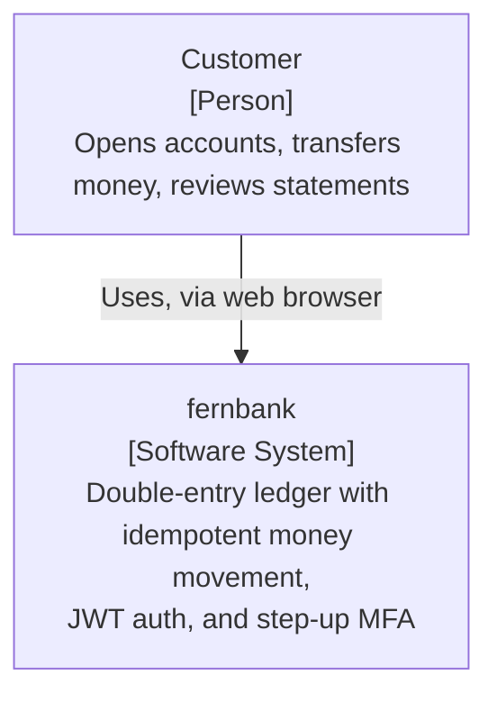
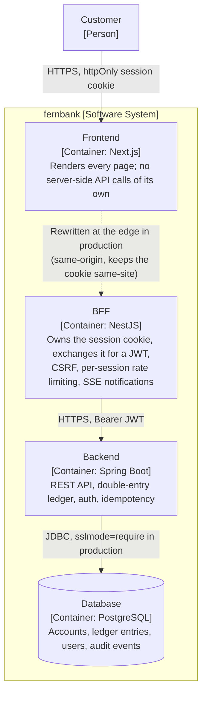

# Architecture

## System overview

fernbank is a retail-banking-style ledger application: customers hold accounts, move
money between them, and see statements. It is a portfolio project — correctness of the
ledger and the security model matter more than feature breadth.

## C4 diagrams

**Level 1 — System context.** No external systems integrate today — no real payment
rails, no KYC provider (see the non-goals list in
[docs/threat-model.md](threat-model.md)) — so this is deliberately small.



**Level 2 — Containers.** Matches the [Components](#components) list below one-to-one.



## Components

- **backend** (`/backend`) — Java 21 / Spring Boot 4, exposes a REST API under
  `/api/v1`. Owns all business rules: account lifecycle, double-entry ledger postings,
  idempotency, auth. PostgreSQL via Spring Data JPA, schema managed by Flyway. Its only
  caller is the BFF (plus, incidentally, a developer hitting Swagger UI directly during
  local development) — it has no awareness that a BFF exists; from its side, the BFF is
  just an ordinary Bearer-JWT client doing the same register/login/refresh/logout/API
  calls a browser used to make directly.
- **bff** (`/bff`) — NestJS, sits between the frontend and the backend (Phase 8). Owns
  an encrypted httpOnly session cookie, exchanges it for the backend's JWT access token
  server-side, adds CSRF double-submit protection, rate-limits per session, aggregates
  the dashboard into one round trip, and streams SSE transaction notifications. The
  browser never sees a JWT. See [ADR 0005](adr/0005-nestjs-bff-session-cookie.md) for
  the full reasoning.
- **frontend** (`/frontend`) — Next.js 16 (App Router), TypeScript, Tailwind, shadcn/ui.
  Talks to the BFF's REST API exclusively — no direct backend access, no DB access.
- **infra** (`/infra`) — `docker-compose.yml` wiring Postgres, MailHog (dev email
  capture), backend, bff, and frontend for local development; `.env.example` for the
  variables each service expects.

## Data flow

```
Browser --(httpOnly session cookie)--> BFF (NestJS, :4000) --(Bearer JWT)--> Backend (Spring Boot, :8080) --> PostgreSQL (:5432)
                                          ^
Browser <--(rendered pages only)---------+--- Frontend (Next.js, :3000)
```

The frontend still serves every page the browser renders, but issues no API calls of
its own server-side (no Route Handlers proxy to the backend anymore) — all client-side
`apiFetch` calls go straight to the BFF, cross-origin, credentialed.

## Transfer with step-up

A transfer at or above `STEP_UP_THRESHOLD_MINOR_UNITS` needs a fresh MFA code, checked
at request time (not at scheduling time — see
[docs/threat-model.md](threat-model.md)'s scheduled-transfer row). The elevated token
never reaches the browser; the bff overwrites its own cached copy and every subsequent
proxied call for that session — including the retry below — rides it automatically.

```mermaid
sequenceDiagram
    participant Browser
    participant BFF as BFF (NestJS)
    participant Backend as Backend (Spring Boot)

    Browser->>BFF: POST /api/v1/transfers (amount >= step-up threshold)
    BFF->>Backend: POST /api/v1/transfers (Bearer JWT)
    Backend-->>BFF: 403 step-up-required
    BFF-->>Browser: 403 step-up-required
    Note over Browser: Wizard shows a step-up form;<br/>customer enters a fresh TOTP code

    Browser->>BFF: POST /api/v1/auth/step-up { code }
    BFF->>Backend: POST /api/v1/auth/step-up (Bearer JWT)
    Backend-->>BFF: 200 { accessToken: elevated }
    Note over BFF: Elevated token overwrites the session's<br/>cached access token - never sent to the browser
    BFF-->>Browser: 200 { elevated: true }

    Browser->>BFF: POST /api/v1/transfers (retry, same request)
    BFF->>Backend: POST /api/v1/transfers (Bearer elevated JWT)
    Backend-->>BFF: 200 transfer applied
    BFF-->>Browser: 200 transfer applied
```

## Money and the ledger

Money is never a float. See [CONTRIBUTING.md](../CONTRIBUTING.md#non-negotiables) for
the non-negotiables: `BIGINT` minor units + ISO-4217 currency, a `Money` value object,
and an append-only double-entry ledger where every `Transaction`'s `LedgerEntry` rows
sum to zero.

## Observability

- **Logs**: the backend emits structured ECS-format JSON (`application-docker.yml`)
  with a `correlationId` in MDC, propagated from the frontend through the bff and into
  the backend as one id per request (`X-Correlation-Id`) — a single browser action
  traces as one id across all three processes, not three separate ones.
- **Metrics**: `/actuator/prometheus` exposes JVM/HTTP metrics plus three app-specific
  counters (`fernbank_transfers_total{outcome}`, `fernbank_logins_failed_total{reason}`,
  `fernbank_idempotency_replays_total{resource}`), none tagged with a customer identity.
  Guarded by HTTP Basic (`ACTUATOR_PROMETHEUS_USER`/`_PASSWORD`) — every other
  `/actuator/**` path needs an ADMIN JWT, and Prometheus has no OAuth2
  client-credentials flow to obtain one.
- **Local-only aggregation**: `docker compose --profile observability up` adds
  Prometheus, Loki, Promtail, and Grafana (`http://localhost:3300`, anonymous
  admin — this profile never binds to anything but localhost) with one provisioned
  dashboard (`infra/grafana/dashboards/fernbank.json`). Deliberately **not** part of
  the default `docker compose up`, and deliberately not deployed to Render — running a
  second observability stack in production is scope this portfolio project doesn't
  need; Render's own logs and metrics dashboard are the production story.
- **Demo data**: the `demo` Spring profile (active by default in `docker-compose.yml`,
  never in the Render deploy) seeds 3 customers/accounts/transactions through the real
  domain services on first boot, idempotently, and logs the demo login at `INFO`.

## Deployment

Backend and bff deploy to **Render**; the database is **Neon Postgres**; the frontend
deploys to **Vercel** via its own Git integration (not a GitHub Actions job). CI
(`backend-ci`/`bff-ci`/`frontend-ci`/`security` in `.github/workflows/`) runs on every
push/PR; Render's own GitHub integration auto-deploys backend/bff on push to `main`
once each service is connected via `render.yaml` — no GitHub Actions deploy job needed.

**One real architectural wrinkle, solved rather than avoided**: Vercel and Render land
the frontend and bff on different registrable domains, which breaks the `SameSite=Lax`
session cookie ADR 0005 designed around a same-site (if cross-origin) local topology.
`frontend/next.config.ts` proxies `/api/v1/*` and `/bff/*` to the bff's Render origin
at Vercel's edge, so the browser only ever sees Vercel's hostname — see ADR 0005's
"Resolved in Phase 9" note for the full reasoning.

### One-time manual setup (not automatable from here — needs your accounts)

1. **Neon**: create a project, copy the host/db/user/password (or the full connection
   string, decomposed into those four parts — `backend/application-prod.yml` expects
   `DB_HOST`/`DB_PORT`/`DB_NAME`/`DB_USER`/`DB_PASSWORD` separately, matching the
   existing env-var shape used everywhere else in this project).
2. **Render**: sign in at render.com with the GitHub account that owns this repo (no
   credit card required for the free plan) → "New" → "Blueprint" → point it at this
   repo → Render detects `render.yaml` at the root and proposes both `fernbank-api` and
   `fernbank-bff` services. When prompted, fill in the `sync: false` secrets for each
   service:
   - `fernbank-api`: `DB_HOST`, `DB_PORT`, `DB_NAME`, `DB_USER`, `DB_PASSWORD`,
     `JWT_PRIVATE_KEY`, `JWT_PUBLIC_KEY`, `MFA_SECRET_ENCRYPTION_KEY`,
     `CORS_ALLOWED_ORIGINS` (your Vercel domain), `ACTUATOR_PROMETHEUS_USER`,
     `ACTUATOR_PROMETHEUS_PASSWORD`.
   - `fernbank-bff`: `BFF_SESSION_ENCRYPTION_KEY`, `BFF_CORS_ALLOWED_ORIGINS` (your
     Vercel domain).

   Once both services are created, confirm their actual `*.onrender.com` hostnames
   (Render normally uses the `name` field but can suffix it if taken) and correct
   `JWT_ISSUER` on `fernbank-api` and `BACKEND_INTERNAL_BASE_URL` on `fernbank-bff` in
   the Render dashboard if they differ from `render.yaml`'s placeholder values.
   Optionally set `NVD_API_KEY` as a GitHub Actions secret for a faster OWASP
   dependency-check run in `backend-ci.yml` (unrelated to Render itself).
3. **Vercel** (new to Vercel? this is the whole setup):
   1. Sign in at vercel.com with the GitHub account that owns this repo.
   2. "Add New Project" → import this repo.
   3. Set **Root Directory** to `frontend` — Vercel auto-detects Next.js once you do.
   4. Add environment variables: `NEXT_PUBLIC_BFF_BASE_URL` = *(leave empty)*,
      `BFF_ORIGIN` = your `fernbank-bff` Render URL (e.g.
      `https://fernbank-bff.onrender.com`), and `NEXT_PUBLIC_BACKEND_HEALTH_URL` =
      your `fernbank-api` Render URL + `/actuator/health` (e.g.
      `https://fernbank-api.onrender.com/actuator/health`) — see the "Known
      limitations" section below for why this one exists.
   5. Deploy. Every push to `main` auto-deploys after this one-time setup — no GitHub
      Actions job needed for the frontend.
   6. Once you know the Vercel URL, update `CORS_ALLOWED_ORIGINS` /
      `BFF_CORS_ALLOWED_ORIGINS` (step 2) on Render to match it, and redeploy backend +
      bff.

### Known limitations

- Vercel edge rewrites to an external origin aren't guaranteed to hold a long-lived SSE
  connection open indefinitely. If the live transaction-notification feed misbehaves in
  production, the existing `EventSource` reconnect logic in
  `use-transaction-notifications.ts` degrades gracefully (per-tab, no data loss) — this
  is a known, documented limitation, not a silent gap.
- **Both services sleep after ~15 minutes idle on Render's free plan.** A request from
  a real browser wakes either one normally (confirmed live, consistently, in ~30-180s
  depending on how cold Neon also is). A request that looks like it comes from the
  bff's own Render-assigned origin does not: confirmed live and repeatedly reproduced
  (2026-08 to 2026-09) that the bff's own calls to the backend's public URL
  (`BACKEND_INTERNAL_BASE_URL` — Render's free plan has no private networking, so this
  is always the backend's plain public HTTPS URL) get rejected with `429` and
  `x-render-routing: hibernate-rate-limited`, decided entirely at Render's edge before
  the request reaches the backend app or logs any resume event. Ruled out as the cause,
  each confirmed live and none of it changed the outcome: request frequency (tried 4s,
  25s, and a single manual attempt spaced a full day apart with near-zero other
  traffic), any auto-retry at all (dropped entirely for a single attempt + manual
  retry), a browser-like `User-Agent` on the bff's own call, and Render's own
  `healthCheckPath` depending on the database (switched to the JVM-only
  `/actuator/health/liveness`, in case Neon's independent cold-start was making Render's
  own health verification flaky on wake). Render support (Hobby-tier, AI-agent-only)
  confirmed the block is edge-level but hasn't identified a cause or resolution as of
  2026-09-11.
- **Confirmed fix (2026-09-12)**: `NEXT_PUBLIC_BACKEND_HEALTH_URL` (see the Vercel setup
  step above) has the *browser* fire a direct, fire-and-forget wake-up request straight
  to the backend's public health URL alongside the normal bff-routed readiness check
  (`use-backend-warmup.ts`) — since a browser-originated request to that same URL has
  consistently not been blocked, this sidesteps the bff-origin block rather than
  resolving its root cause (which Render's own support never identified). Verified live
  against a genuinely cold stack (both services slept, no manual pre-warming): visiting
  the Vercel URL normally now wakes the backend and completes login successfully. This
  is a sidestep, not a root-cause fix — if it stops working, or Render clarifies the
  actual cause, see `bff/src/warmup/warmup.controller.ts`'s doc comment for the full
  incident history before trying another variation, since several plausible-sounding
  fixes were already tried and confirmed not to work.

## ADR index

- [0001](adr/0001-record-architecture-decisions.md) — ADRs, and why.
- [0002](adr/0002-spring-boot-4-baseline.md) — Spring Boot 4 baseline.
- [0003](adr/0003-enum-vs-lookup-table.md) — enums + CHECK constraints over lookup tables.
- [0004](adr/0004-jwt-vs-server-sessions.md) — JWT + rotating refresh tokens (backend
  mechanism still accurate; browser-facing consequences superseded by 0005).
- [0005](adr/0005-nestjs-bff-session-cookie.md) — the BFF's session cookie, CSRF, and
  cookie-domain decisions.
- [0006](adr/0006-double-entry-append-only-ledger.md) — double-entry, append-only
  ledger over a mutable balance column.
- [0007](adr/0007-money-as-minor-units.md) — money as `BIGINT` minor units + currency
  code, never a float, exposed over the API as a decimal string.

## To be added as later phases land

- C4 context and container diagrams.
- Sequence diagram: transfer with step-up MFA, through the BFF.
